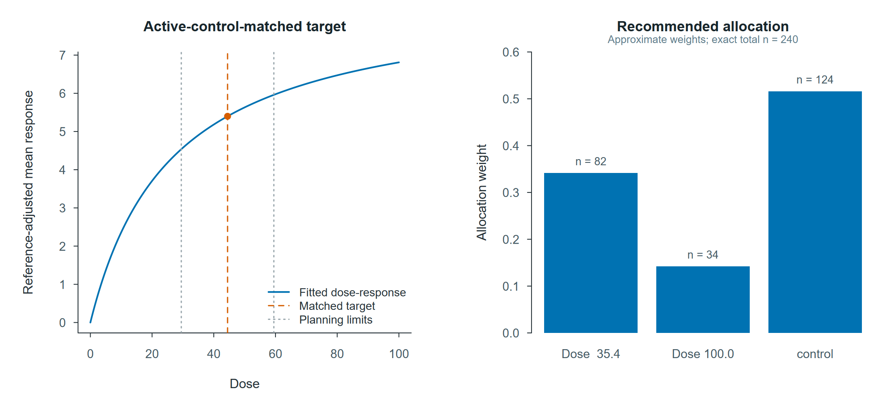
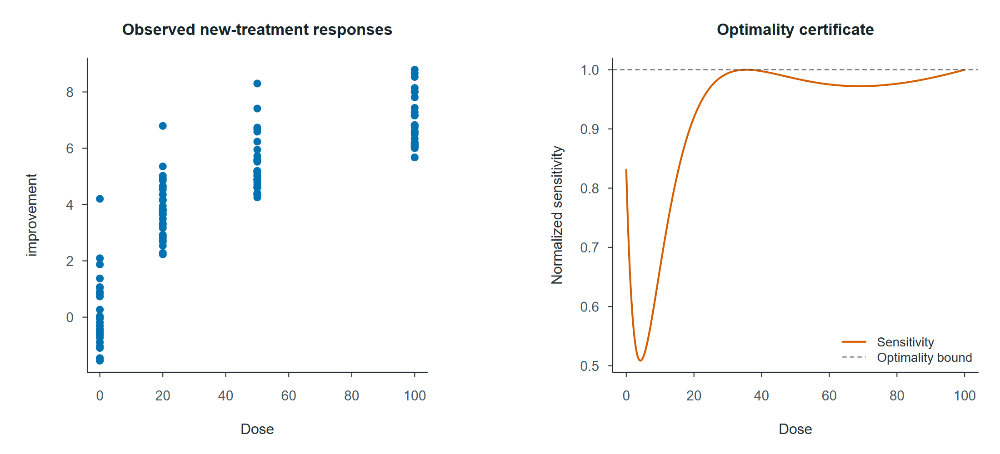

# rtmodesign

[](https://github.com/haohaostats/rtmodesign/actions/workflows/R-CMD-check.yaml)
[](https://github.com/haohaostats/rtmodesign/releases/latest)
[](LICENSE)

`rtmodesign` provides an ordinary-user workflow for regularized third-order
moment optimal design in active-controlled dose-response studies.

## Installation

Install the development release from GitHub:

```r
install.packages("remotes")
remotes::install_github("haohaostats/rtmodesign")
```

## Scope of version 1.0.0

The public interface is designed for continuous outcomes from patient-level
pilot or historical data. Users provide the clinical variables, a built-in
dose-response model, the active-control label, the allowed dose range, and
optionally the future sample size.

```r
library(rtmodesign)
data(rtmo_example)

fit <- rtmo_design(
  improvement ~ dose | treatment,
  data = rtmo_example,
  model = "mm",
  active_control = "control",
  dose_range = c(0, 100),
  n = 240
)

fit
summary(fit)
plot(fit, type = "dose_response")
plot(fit, type = "design")
plot(fit, type = "diagnostic")
```

The bundled example data provide a complete, immediately runnable illustration
of the ordinary-user workflow.

The single call fits the selected dose-response model, estimates the matched
active-control dose, estimates residual moments through order six, applies
adaptive regularization when required, constructs the approximate RTMO design,
checks its sensitivity-function certificate, and generates an exact allocation
when `n` is supplied. When `target_region` is omitted, the package uses an
automatic planning region centered at the estimated target with half-width 15
percent of the allowed dose range.

## Example output

The example identifies an active-control-matched target dose of **44.47** and
constructs a design over the automatically selected planning region from
**29.47 to 59.47** dose units.



The exact allocation for a future sample size of 240 is:

| Study component | Dose | Approximate weight | Exact n |
|:--|--:|--:|--:|
| New treatment | 35.40 | 0.3414 | 82 |
| New treatment | 100.00 | 0.1423 | 34 |
| Active control | -- | 0.5163 | 124 |

The diagnostic view combines the observed pilot data with the normalized
sensitivity function used to verify the computed design.



| Diagnostic | Result |
|:--|--:|
| Analysis observations | 150 |
| Residual skewness | 1.065 |
| Raw moment condition number | 30.56 |
| Moment regularization | Not required |
| Maximum normalized sensitivity | 1.000 |
| Optimality certificate | Passed |

## Supported models

Version 1.0.0 supports `linear`, `mm`, `emax`, `sigmoid_emax`, and
`exponential` dose-response models for continuous outcomes and one active
control.

## License

MIT License. See `LICENSE` for details.
